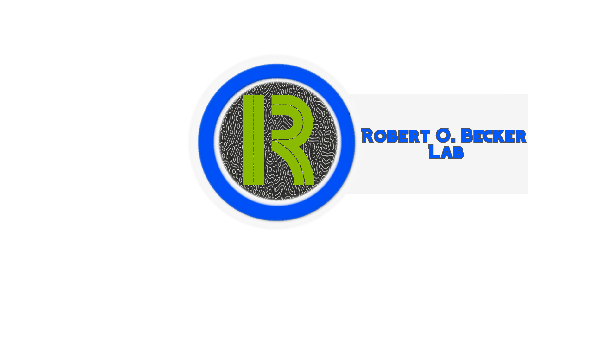
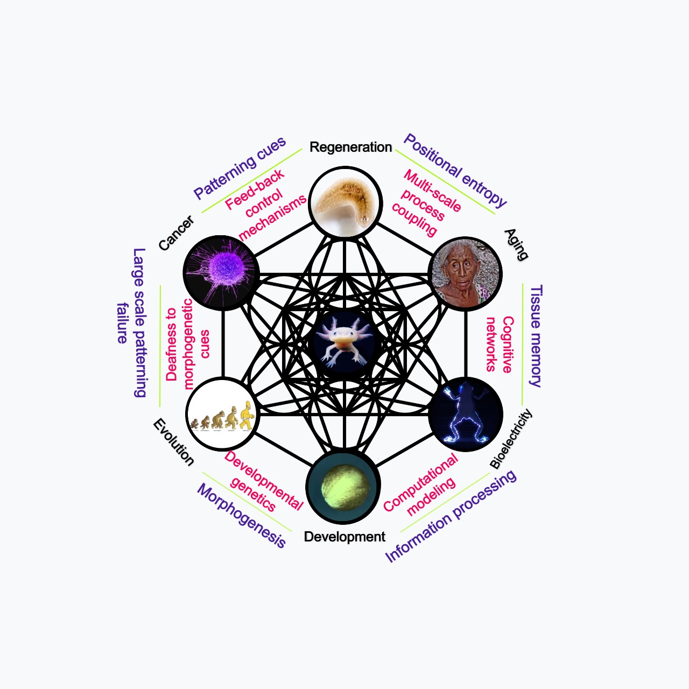
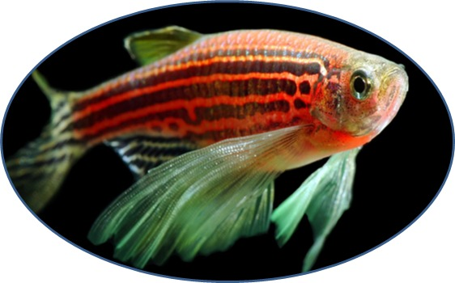

# Welcome to the Robert O. Becker Lab

 
 

## Who we are?

We are a diverse group of individuals that are interested in researching novel ideas and theoretical approaches that could help us understand pattern formation in multicellular organisms and large-scale control of 3D-form. We are specifically interested in understanding the molecular, bioelectrical and computational mechanisms that sustain the development of complex anatomy in animals , the regeneration of tissues  as well as how these mechanisms break-down in cancer and aging. Our approach uses techniques that encompass many areas of science like bioinformatics, systems biology, computational modeling , information theory and biophysics to face these complex puzzles. At the present time we are focused in the standarization of a zebrafish model and the science communication of recent developments in bioelectricity focused developmental biology. The goal of the Robert O. Becker lab is to understand the fundamental principles and rules that guide cells to synchronyze towards large-scale patterning goals and to demystify what exactly entails bioelectricity focused research in developmental biology, regeneration, cancer and aging.

## Mision
The Robert O. Becker lab must become a role model for the first safe DIY-BIO laboratory focused on developmental, systems and synthetic biology, approaching these sciences from the lenses of Biophysics, cognitive sciences in order to understand complex issues like how cells manage to synchonyze towards complex anatomies, how when a tissue is injured cells regenerate and manage to know how to halt proliferation when there is no more need to and why cells stop being so efficient at these tasks as time passes. In general, some the ideas we want to study are:

  - How bioelectrical signals are used by cells to communicate individual and collective messages that are used to heed and subscribe to the patterning needs of the host organism.
 - To understand  the top-down controls that bodies use to produce large-scale patterning outcomes and how the coupling of different networks of . For example, we use computational analysis of primitive bacterial biofilms models to understand the biophysical and  cognitive basis for the synchronyzation  of hetereogeneous populations of cells. We also are interested in used proven software to model bioelectrical patterns and their associated gene regulatory networks during developmental stages of zebrafish ( _Danio rerio_ ) Our focus is producing computer models of patterning  to connect gene regulatory networks, membrane biophysics, systems biology to complex anatomies in multicellular organisms.
   
  
 
  
We want to make our findigs reproducible and easily accesable to the science community in order to inspire a new generation of scientists that are willing to conduct research in these emerging ideas that at the time are not being developed in any laboratory in México and many other underdeveloped countries.

## Vision
To inspire novel research endevours and technologies focused on unraveling the mechanisms that living animals use to mantain and control large-scale patterning events in their bodies and how these break down when they age. By studying, researching and communicating our findings in the fundamental principles that guide autopoiesis in multicellular organisms  we hope to shape the future of developmental, systems and synthetic biology.

## Education
 We will conduct talks, seminarys and workshops to communicate the science and inspiration for many of the ideas we will be working on in this lab. At the moment we are curating these.
## Research Opportunities
If you are interested in working with us or have any doubt please send a message ! We are always open :)
We are currently working on studying:
- Bioelectrical patterns in the regeneration of fins of Zebra fish
- The developmental stages of zebrafish to find what kind of bioelectrical patterns emerge during its morphogenesis. 

 
# Contact
Nini Ortiz Vales
Founder and director of the Robert O. Becker Lab .
mail : niniortiz99@gmail.com
